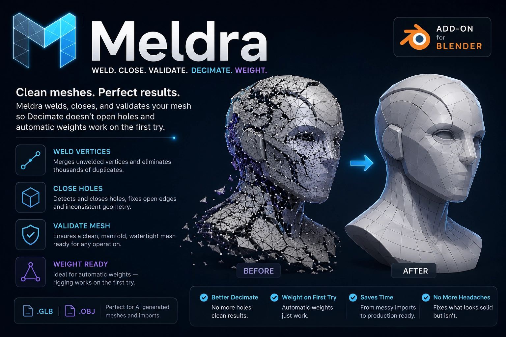

# Meldra

Blender add-on that welds, closes, and validates a mesh so that **Decimate** doesn't open holes and **automatic weights** for rigging work on the first try.

It's designed for what comes out of 3D AI generators and `.glb` / `.obj` importers: meshes that _look_ solid but are actually thousands of loose triangles inside, because every corner of every face has its own unwelded vertex.

_Meldra_ comes from **meld**—that's exactly what it does.

## Installation

Requires **Blender 4.2 or higher**, including 5.x.

1.  Generate the zip by double-clicking `empaquetar.bat`, or from the console:
    

bash

empaquetar.bat

2.  In Blender: `Edit > Preferences > Add-ons`, click the `▾` button at the top right, **Install from Disk…**, and choose `dist\meldra-2.0.1.zip`.  
    You can also drag the zip into the Blender window.
    
3.  The panel appears in the **3D View > sidebar (key `N`) > "Meldra" tab**.
    

## How to use it

1.  Select the mesh and click **Analyze Mesh**.
    
2.  Check the report. Everything shown in red is a real issue.
    
3.  To see _where_ the problem is, use the **View the issue** buttons—they switch to edit mode with those elements selected.
    
4.  Click **Repair All**.
    
5.  Verify that it says `Mesh closed` at the bottom.
    
6.  Now **Decimate**. And then, **Rig**.
    

### Report

Line

What it means

Duplicate vertices

Vertices on top of another that are unwelded. **This is the cause of holes when decimating.**

Disconnected pieces

Separate islands. More than 1 is almost always floating junk.

Holes (boundary edges)

Edges with only one face. These are the actual holes.

Edges with >2 faces

Impossible geometry. Breaks booleans, printing, and rigging.

Non-manifold vertices

Two surfaces connected only at a single point.

Zero area

Degenerate faces. Cause heat weight failures.

Interiors

The second shell that many generated models come with.

Inconsistent normals

Neighboring faces facing opposite directions.

Euler V−E+F

2 for a closed mesh without handles; 0 with a through-hole.

Volume

Only calculated if the mesh is closed. If positive, the normals face outward.

### Repair

The steps are executed **in this order**, which is what matters:

1.  Apply rotation and scale.
    
2.  Remove shape keys (repair changes topology and invalidates them; they also block Decimate).
    
3.  Clear custom normals.
    
4.  Delete loose geometry.
    
5.  **Weld vertices** — the step that fixes the problem.
    
6.  Dissolve degenerates and delete zero-area faces.
    
7.  Delete interior faces.
    
8.  Fill holes.
    
9.  Delete small loose pieces (optional, off by default).
    
10.  Recalculate normals, and flip the entire mesh if the volume is negative.
    

In between, it sweeps for orphan vertices three times, because welding and dissolving create new orphans.

**Weld tolerance.** It's calculated based on the model's diagonal, so it works equally well on a 2 m or 2 cm model:

-   _Precise_ (1e-5 of diagonal): for AI meshes and glTF/OBJ exports, where duplicates are exactly at the same position. **This is the one you want almost always.**
    
-   _Normal_ (1e-4): for scans and photogrammetry.
    
-   _Aggressive_ (1e-3): brute-force closure; may eat fine detail.
    
-   _Manual_: exact distance in Blender units.
    

### Armature

The panel lists the requirements needed for heat weight assignment (_Bone Heat Weighting_) and gives a verdict. **Prepare for Armature** repairs and additionally forces applied scale and sets the origin if you ask it to. **Parent with automatic weights** does the `Ctrl+P > With Automatic Weights` and, if it fails, tells you which requirement is the likely culprit.

### Remesh

Last resort when the mesh is beyond salvage. Voxel remesh **always** comes out closed and manifold, but UVs and materials are lost.  
QuadriFlow gives quad-based topology and requires the mesh to already be manifold: repair first.

## Languages

Meldra speaks the **48 languages that Blender can display**. It translates itself: it uses the language set in `Preferences > Interface > Translation`.

> Abkhaz · German · Arabic · Bulgarian · Catalan · Czech · Chinese (Simplified and Traditional) · Korean · Danish · Slovak · Slovenian · Spanish · Esperanto · Basque · Finnish · French · Georgian · Greek · Hebrew · Hindi · Hungarian · Indonesian · British English · Italian · Japanese · Kyrgyz · Lithuanian · Malayalam · Dutch · Norwegian (Bokmål) · Persian · Polish · Portuguese (Brazil and Portugal) · Romanian · Russian · Serbian (Cyrillic and Latin) · Swahili · Swedish · Thai · Tamil · Turkish · Ukrainian · Urdu · Vietnamese

That's **195 strings in 48 languages: 9,171 translations**, and `pruebas/prueba.py` checks that no language has extra or missing keys, and that format markers (`%d`, `%s`, `%.4f`) survive translation in the same order — a mismatch there would break the add-on at runtime.

Each language lives in `meldra/idiomas/`, in its own isolated dictionary: you can fix one without touching the others. Corrections from native speakers are welcome.

> For some terms that Blender already translates on its own (_Holes_, _Loose_, _N-gons_…) Blender uses its own dictionary and not ours. This is desirable: it makes the add-on speak the same language as the rest of the program.

## Packaging and publishing

bash

empaquetar.bat

Runs the 160 checks, generates `dist\meldra-<version>.zip`, validates the manifest with Blender itself, and tells you where to upload it. If Blender is not installed, it skips the tests and validation, but still generates the zip.

To bump version: change `version` in `meldra/blender_manifest.toml` and run the batch again. The `id` doesn't change, so Blender replaces the previous installation instead of duplicating it.

Also works without Windows:

bash

python empaquetar.py

## Note about UVs

Welding does **not** damage UVs. Texture coordinates live on the face corners, not on the vertices, so merging two coincident vertices leaves each face with the coordinates it already had and the seam survives. Measured on a fully unwelded sphere at all three tolerances: same corners, same coordinates, same UV area, down to the last decimal.

What does cost you texture: the patches that close a hole arrive with no coordinates at all (they land on `0,0`), and **Decimate** and the two rebuild buttons redistribute or discard them. If the texture matters, bake it from the original dense model onto the repaired one (`Bake` with _Selected to Active_).

**glTF splits vertices, and it does it in both directions.** In glTF a vertex *is* a position plus a UV, so a vertex sitting on a UV seam has to be duplicated.

On the way in, tick **Merge Vertices** in the _Geometry_ section of the import dialog and you skip the whole thing.

On the way out there is no way around it. Save a repaired mesh as `.glb`, reopen it, and Analyze reports duplicates, boundary edges and loose parts again. Nothing is broken: the geometry is intact and only the seams came apart, which is why the report says **Watertight once welded** instead of a red warning. One press of Repair All puts it back, and it loses nothing — five export/reopen/repair cycles on the same model gave byte-identical UVs and volume every time. `.fbx` and `.obj` round-trip without splitting anything.

## What's new in 2.0.1

Every fix below came out of a mesh that actually failed, and every one of them has a regression test in `pruebas/prueba.py`. The check count went from 80 to 160.

**Repair All closes meshes it used to give up on**

-   Faces hanging off an edge that already had two are peeled away.

-   Wire edges attached to the surface are deleted. _Delete Loose Geometry_ now does what its own description promises.

-   Orphan faces whose three edges are all boundary: the "hole" _is_ the face, so there is nothing to fill and they are removed. This was the one that left a two-triangle spike keeping a whole golem from ever closing.

-   Non-manifold vertices are split, including the ones welding itself creates when two separate closed pieces touch.

-   Pinched boundary loops get closed, and _Max Sides_ is finally honoured.

**Repair All no longer breaks meshes that were already fine**

-   Two closed pieces touching along an edge came out open after welding. Fixed.

-   A solid built from welded cubes — voxel exports, kitbashes — disintegrated into loose patches. Fixed.

-   Triangulating a patch could reuse an edge that already had two faces and leave it with three. Patches are now fanned from a new centre vertex, which cannot collide with anything.

-   Splitting a vertex no longer wipes the UVs around it.

-   A single stray vertex far from the model no longer inflates the weld distance and dissolves the whole mesh.

**Faster**

-   Repairing a mesh with thousands of holes went from minutes to under a second. 52,662 holes now close in 0.47 s.

**Clearer report**

-   New verdict **Watertight once welded**, for a mesh that is only split along its seams — exactly what comes back from a `.glb` round trip. A real hole still reads _Not watertight_, in red.

## Credits

**xander.dice**

-   Instagram: [@xander.dice](https://www.instagram.com/xander.dice)
    
-   YouTube: [@xanderdice](https://www.youtube.com/@xanderdice)
    
-   Facebook: [djxanderdice](https://www.facebook.com/djxanderdice)
    

